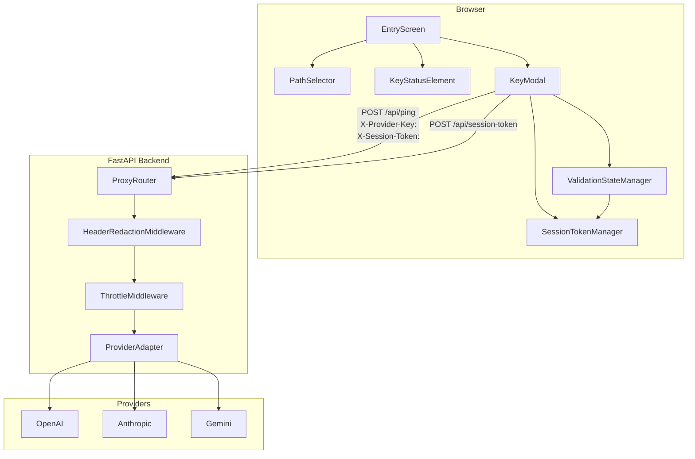
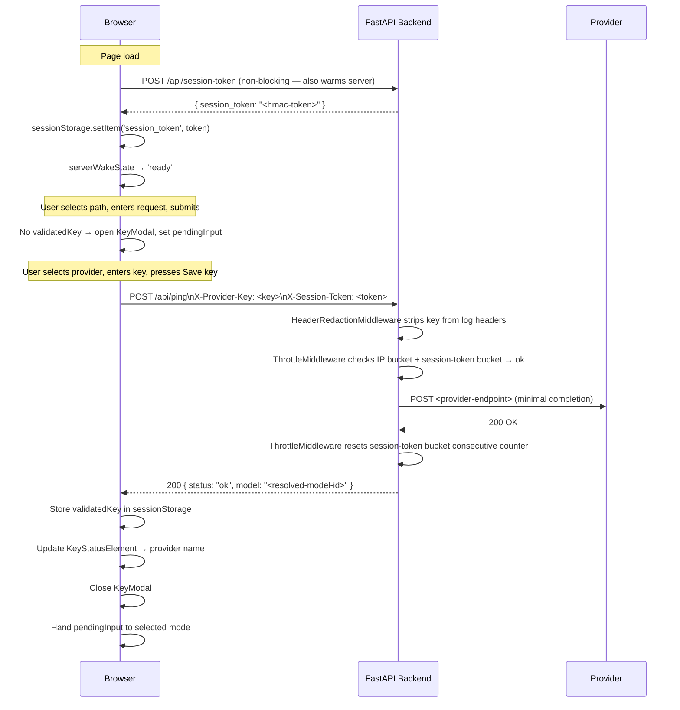
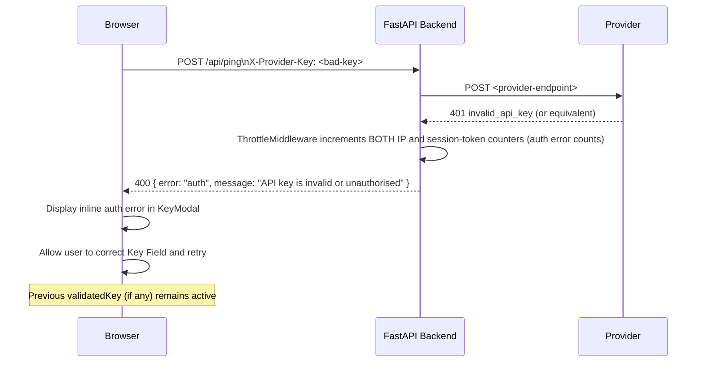
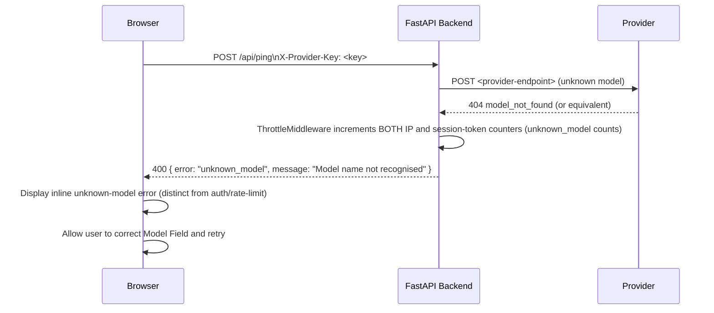
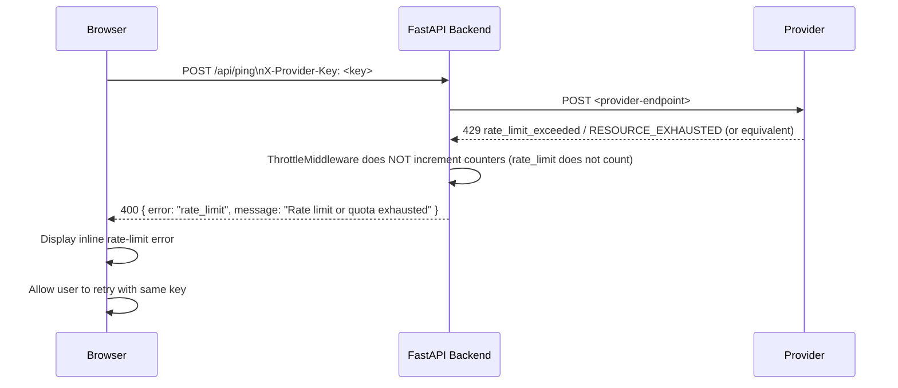
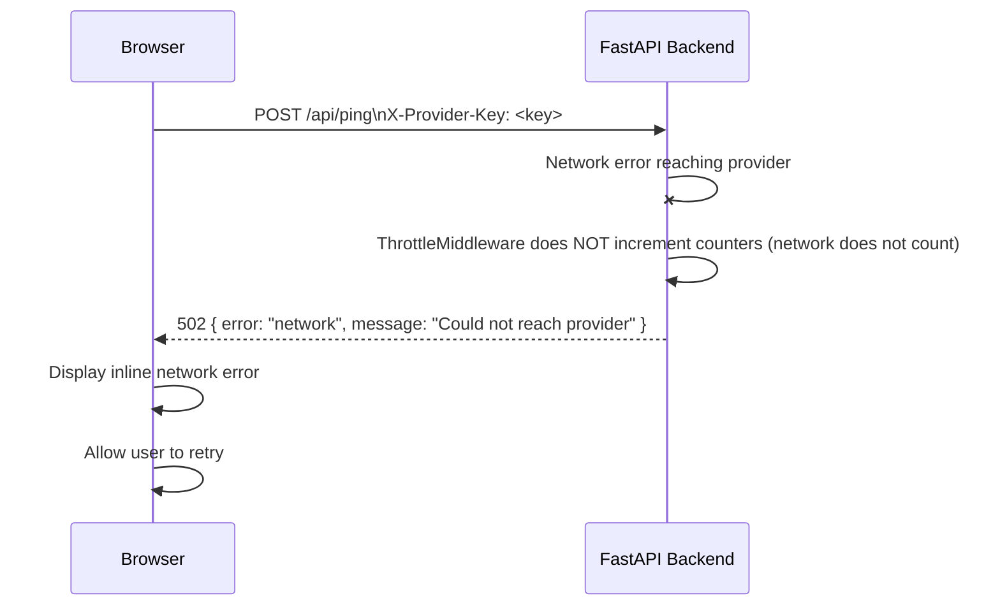
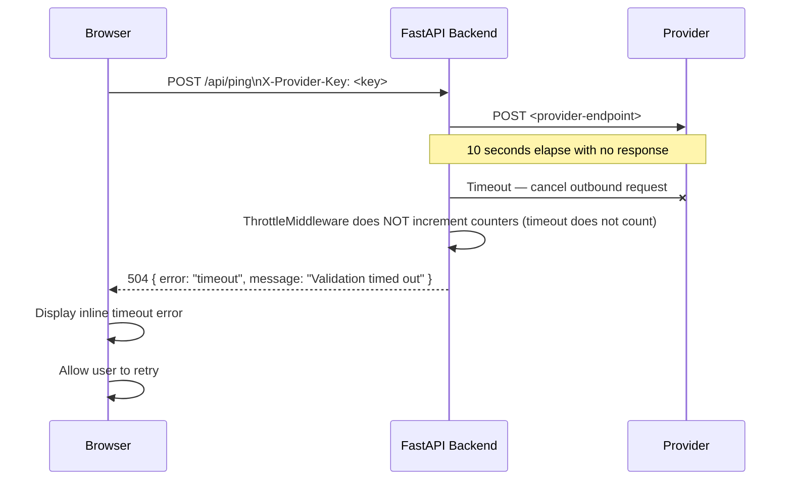
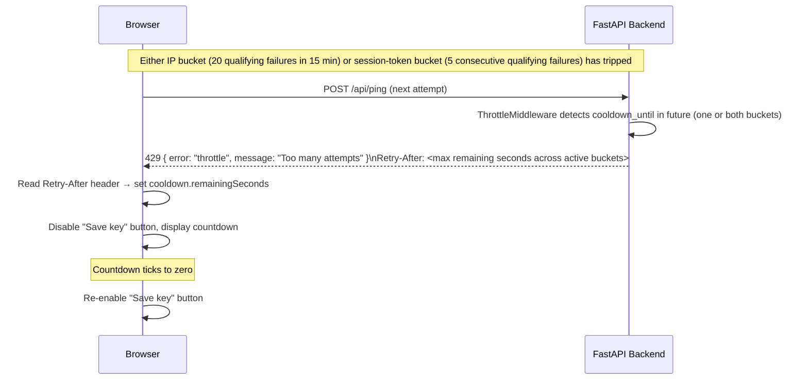
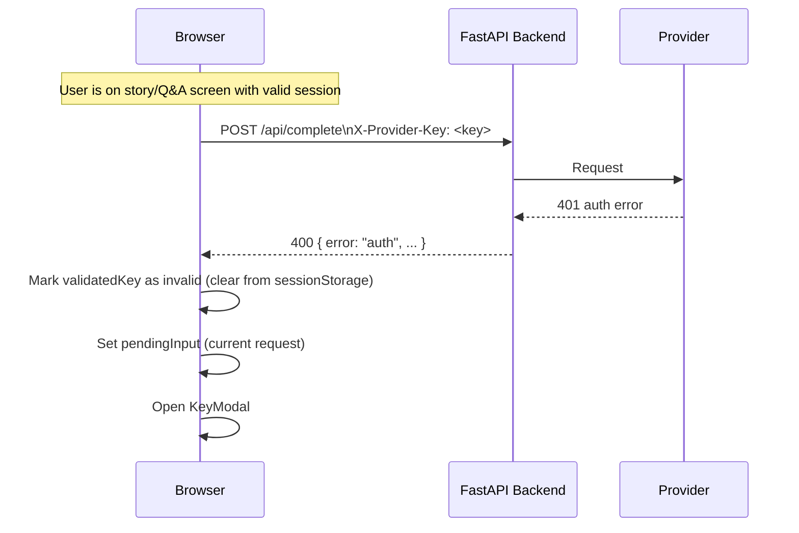
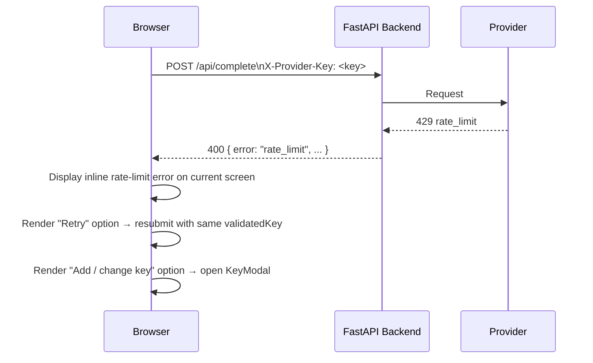

# Design Document: Mahabharata Entry Screen & API Key Handling

## Overview

The Entry Screen is the first surface the user encounters in the Mahabharata guide web app. It presents path selection ("Hear a Story" / "Ask a Question"), collects the user's request, and defers credential collection until the first submission. When a Validated Key does not yet exist, the Key Modal intercepts the submit action, collects provider selection, API key, and optional model name, validates them with a Ping Call through the backend proxy, and — on success — hands the preserved Pending Input off to the selected mode without requiring resubmission.

All provider communication is proxied through the Python/FastAPI backend. The browser never contacts a provider directly. The API key is transmitted in a custom HTTP header (`X-Provider-Key`) on every request and is removed from all log records by middleware before any logging framework processes the request. It is never persisted server-side.

---

## Stack and Hosting

### Frontend
- **Framework:** React with TypeScript
- **Build tool:** Vite
- **Deployment:** Vercel (production)
- **Dev server:** `http://localhost:5173` (default Vite port)

### Backend
- **Framework:** Python + FastAPI
- **Deployment:** Render (free tier, stateless web service)
- **Known constraint:** Render free tier sleeps after 15 minutes of inactivity. The session-token fetch on page load serves as a warm-up call. See Cold-Start Mitigation.
- **Real IP header:** Render's load balancer injects `X-Forwarded-For`. Configure FastAPI with `ProxyHeadersMiddleware` (see Throttle section).

---

## Architecture



---

## Components

### Client-Side Components

#### EntryScreen

The root component for the initial view. Renders PathSelector, a request input area, and KeyStatusElement. On mount it initiates `POST /api/session-token` non-blocking — this call also serves as the backend warm-up (see Cold-Start Mitigation). Delegates all state management to ValidationStateManager.

#### PathSelector

Renders the two path options: "Hear a Story" and "Ask a Question". Records the user's selection in ValidationStateManager as part of `pendingInput`. Does not require a Validated Key to be interactive.

#### KeyStatusElement

Persistent element accessible from every screen. Reads `validatedKey` from ValidationStateManager to determine display state:
- No Validated Key → displays "No key added yet"
- Validated Key present → displays the active provider name (e.g. "OpenAI")

Always renders an "Add / change key" control that opens the Key Modal via ValidationStateManager.

If `serverWakeState` is `'waking'`, displays a "Waking up the server…" status indicator.

#### KeyModal

Dialog that collects and validates credentials. Reads and writes state via ValidationStateManager. Contains:
- Provider selector (OpenAI, Anthropic, Gemini) — no default selection
- Key Field (masked text input) with show/hide toggle
- Model Field (free-text, optional)
- "Save key" button
- Inline error display area
- Loading indicator (shown during `modalState === 'validating'`)
- The statement: "Your key is held in this tab only and is never stored on our servers or written to logs."

Behaviour:
- Changing the Provider selection clears the Key Field.
- Pressing "Save key" without a Provider selected shows an inline error; no Ping Call is sent.
- Pressing "Save key" without a key entered shows an inline error; no Ping Call is sent.
- During validation the "Save key" button is disabled and the loading indicator is shown.
- During an active Cooldown Period the "Save key" button is disabled and the remaining wait time is displayed (driven by `cooldown.remainingSeconds`).
- On validation success: closes, hands Pending Input off to selected mode.
- On validation failure: shows the normalised error inline; allows correction and retry.
- Dismissing without saving preserves Pending Input; no generation runs.

#### SessionTokenManager

Manages the HMAC-signed opaque session token issued by the backend. On first load (no token in sessionStorage) it fires `POST /api/session-token` non-blocking; this call also warms the backend server. On subsequent page loads within the same tab it reads the existing token from sessionStorage without a network call. The token is included in every backend request as the `X-Session-Token` header.

#### ValidationStateManager

Central client-side state container. Owns and exposes all state defined in Section C. Responsibilities:
- Persisting and restoring `validatedKey` and `sessionToken` to/from sessionStorage.
- Setting `pendingInput` when the user submits a request.
- Transitioning `modalState` between `'closed'`, `'open'`, and `'validating'`.
- Driving `cooldown` state from the `Retry-After` header on 429 responses.
- Tracking `serverWakeState` from session-token fetch timing.
- On validation success: writing `validatedKey` to sessionStorage, closing the modal, triggering handoff.
- On validation failure that is not a cooldown trigger: updating inline error state without clearing `validatedKey`.

---

### Server-Side Components

#### ProxyRouter (FastAPI)

Registers the two endpoints used by the entry screen: `POST /api/session-token`, `POST /api/ping`. Routes are defined in a dedicated `router` module and included in the main FastAPI application. The router itself contains no business logic; it delegates to the appropriate service layer.

#### HeaderRedactionMiddleware (FastAPI)

A Starlette middleware that runs before any route handler and before any logging call. It intercepts the incoming `Request` object and removes `X-Provider-Key` from the headers before the request object is passed downstream. It also attaches a logging filter to the request-scoped logger that suppresses any string containing the key value.

R8.7 and R8.8 are satisfied by construction: the HeaderRedactionMiddleware removes `X-Provider-Key` from all log records before any logging framework sees it, and the ProviderAdapter never writes the key to any storage layer.

```python
class HeaderRedactionMiddleware(BaseHTTPMiddleware):
    REDACTED_HEADERS = {"x-provider-key"}

    async def dispatch(self, request: Request, call_next):
        # Rebuild headers with sensitive keys removed
        filtered = {
            k: v for k, v in request.headers.items()
            if k.lower() not in self.REDACTED_HEADERS
        }
        request._headers = Headers(raw=[
            (k.encode(), v.encode()) for k, v in filtered.items()
        ])
        return await call_next(request)
```

#### ThrottleMiddleware (FastAPI)

Runs after HeaderRedactionMiddleware (so the key is already removed from the request). Enforces rate limiting using two independent buckets. **Only `auth` and `unknown_model` failures increment the counters.** `timeout`, `network`, `rate_limit`, and `other` failures do not count.

**IP bucket (primary):**
- Key: real client IP address (extracted via `ProxyHeadersMiddleware` — see Real IP extraction below)
- Threshold: 20 qualifying failures within a rolling 15-minute window
- Cooldown: 5 minutes after the threshold is reached
- Rationale: protects against distributed abuse from many tabs; 20 is high enough not to false-positive a legitimate user making multiple provider switches

**Session-token bucket (secondary):**
- Key: `X-Session-Token` value
- Threshold: 5 consecutive qualifying failures
- Cooldown: 5 minutes
- Rationale: catches single-tab brute forcing before the IP bucket triggers; 5 attempts covers realistic typos across a single session

**Either bucket tripping triggers the cooldown.** When a request is blocked, the `Retry-After` value is the maximum of the two buckets' remaining times.

`POST /api/session-token` is also subject to IP-based throttling: maximum 30 requests per 15-minute window per IP. When exceeded, return HTTP 429 with `Retry-After`.

In-memory only (v1). ⚠️ Failure counters reset on server restart. This is a known limitation of v1; a persistent store (e.g. Redis) would be needed for production hardening.

**Real IP extraction (X-Forwarded-For):** On Render, the real client IP is forwarded in `X-Forwarded-For` by Render's load balancer. FastAPI must be configured to trust this header:

```python
from fastapi import FastAPI
from uvicorn.middleware.proxy_headers import ProxyHeadersMiddleware

app = FastAPI()
# Trust exactly one proxy hop (Render's load balancer)
app.add_middleware(ProxyHeadersMiddleware, trusted_hosts="*")
```

With this middleware applied, `request.client.host` returns the real client IP. Without it, all requests appear to come from Render's internal load balancer IP, breaking IP-based throttling.

⚠️ `trusted_hosts="*"` trusts all proxy hops. On Render this is safe because Render strips incoming `X-Forwarded-For` headers from untrusted sources. If deploying elsewhere, restrict to the known proxy IP.

#### ProviderAdapter (FastAPI)

Per-provider translation layer. Given a normalised ping request (`{ provider, key, model }`), it:
1. Constructs the provider-specific HTTP request (URL, headers, body for a ~1-token completion).
2. Sets a 10-second timeout on the outbound HTTP call.
3. Receives the provider response and maps it to the internal error set.
4. Returns either `{ "status": "ok" }` or `{ "error": "<internal_code>", "message": "<human-readable>" }` to the ProxyRouter.

The key is read from the `X-Provider-Key` header of the incoming FastAPI request (before redaction removes it from logging — the middleware removes it from the loggable representation but the raw request body is accessible to the route handler via `request.headers.get("x-provider-key")`).

⚠️ The HeaderRedactionMiddleware rebuilds the request headers object used by loggers; the raw ASGI scope is not modified. The ProviderAdapter must read the key from `request.headers.get("x-provider-key")` before the middleware replaces the headers object, or the middleware must preserve the key in a request-state slot (e.g. `request.state.provider_key`) after redacting it from the loggable headers. The chosen implementation must be verified during code review.

---

## Request Flows

### Happy Path: First Submit → Validation → Handoff



### Failure Branch: Auth Error



### Failure Branch: Unknown Model Error



### Failure Branch: Rate-Limit / Quota Error



### Failure Branch: Network Failure



### Failure Branch: Timeout



### Failure Branch: Throttle Cooldown Entered



### Auth Error During a Real Request (R21)



### Rate-Limit Error During a Real Request (R22)



---

## State Model

All client-side state is owned by ValidationStateManager. State persisted to sessionStorage survives page refresh within the same tab and is cleared on tab close.

### State Shape

```typescript
interface ClientState {
  // The user's queued request. Set when user submits without a Validated Key.
  // Also preserved when Key Modal is dismissed without saving (R23).
  pendingInput: PendingInput | null;

  // The currently active validated credential set.
  // Written to sessionStorage on validation success.
  // Cleared when an auth error is received on a real request (R21).
  validatedKey: ValidatedKey | null;

  // HMAC-signed opaque token issued by the backend on first load.
  // Used as the secondary component of the throttle key.
  sessionToken: string | null;

  // Cooldown state driven by Retry-After header from 429 responses.
  cooldown: CooldownState;

  // Key Modal lifecycle state.
  modalState: 'closed' | 'open' | 'validating';

  // Server wake state, driven by /api/session-token response timing (which doubles as warm-up).
  // 'waking' is shown if the session-token call has not responded within 2 seconds.
  serverWakeState: 'unknown' | 'waking' | 'ready';
}

type PendingInput =
  | { type: 'typed';     value: string }
  | { type: 'character'; value: string }
  | { type: 'parva';     value: string }
  | { type: 'surprise';  value: null   };

interface ValidatedKey {
  provider: 'openai' | 'anthropic' | 'gemini';
  key: string;       // raw API key string
  model: string;     // resolved model ID returned by /api/ping in the `model` field
}

interface CooldownState {
  active: boolean;
  remainingSeconds: number;  // 0 when not active; counts down to 0 while active
}
```

### SessionStorage Keys

| Key | Value shape | Cleared when |
|-----|-------------|--------------|
| `validated_key` | JSON-serialised `ValidatedKey` | Tab close; auth error on real request (R21) |
| `session_token` | Opaque HMAC string | Tab close |

No other keys are written to sessionStorage by this feature. Nothing is written to localStorage or cookies.

### State Transitions

| Event | Before | After |
|-------|--------|-------|
| Page load — no sessionStorage | All null / defaults | `sessionToken` populated after `/api/session-token` response; `serverWakeState: 'unknown'` |
| Page load — sessionStorage present | — | `validatedKey` and `sessionToken` restored; `cooldown` reset to `{ active: false, remainingSeconds: 0 }` (cooldown is not persisted across refreshes — a refresh gives the user a clean slate) |
| Session-token fetch starts (response > 2 s) | `serverWakeState: 'unknown'` | `serverWakeState: 'waking'` |
| Session-token fetch completes | `serverWakeState: 'waking'` | `serverWakeState: 'ready'` |
| User submits request, no `validatedKey` | `modalState: 'closed'`, `pendingInput: null` | `pendingInput` set, `modalState: 'open'` |
| User submits request, `validatedKey` present | — | `pendingInput` set, handoff fires immediately |
| User opens Key Modal via "Add / change key" | `modalState: 'closed'` | `modalState: 'open'` |
| User presses "Save key" | `modalState: 'open'` | `modalState: 'validating'` |
| Validation success | `modalState: 'validating'`, old `validatedKey` | `validatedKey` updated (sessionStorage written), `modalState: 'closed'`, handoff triggered |
| Validation failure (not cooldown) | `modalState: 'validating'` | `modalState: 'open'`, inline error set; `validatedKey` unchanged |
| Validation failure — 5th consecutive | `modalState: 'validating'` | `modalState: 'open'`, `cooldown: { active: true, remainingSeconds: 300 }` |
| Cooldown countdown reaches 0 | `cooldown.active: true` | `cooldown: { active: false, remainingSeconds: 0 }` |
| User dismisses Key Modal (no save) | `modalState: 'open'`, `pendingInput` set | `modalState: 'closed'`; `pendingInput` unchanged |
| Auth error on real request | `validatedKey` set | `validatedKey: null` (sessionStorage cleared), `pendingInput` set, `modalState: 'open'` |
| Client AbortController fires on /api/ping (20 s) | `modalState: 'validating'` | `modalState: 'open'`, `inlineError: 'timeout'` |

---

## FastAPI Endpoint Specifications

### `GET /health`

**Purpose:** Lightweight liveness probe. Used by the browser on page load to warm a sleeping server and to determine `serverWakeState`.

**Auth:** None.

**Response (200):**
```json
{ "status": "ok" }
```

No failure modes defined for this endpoint — network-level failures are ignored by the browser (fire-and-forget).

---

### `POST /api/session-token`

**Purpose:** Issues a stateless HMAC-signed opaque session token on first page load. The token is used as the secondary component of the throttle key (`IP + token`), providing per-tab fairness on shared IPs.

**Auth:** None.

**Request:** Empty body.

**Response (200):**
```json
{ "session_token": "<opaque-hmac-string>" }
```

**Token construction:**
```python
import hmac, hashlib, secrets, time

def issue_session_token(secret_key: bytes) -> str:
    nonce = secrets.token_hex(16)
    ts = str(int(time.time()))
    payload = f"{nonce}:{ts}"
    sig = hmac.new(secret_key, payload.encode(), hashlib.sha256).hexdigest()
    return f"{payload}:{sig}"
```

The token is opaque to the browser. The backend does not need to validate the token on every request (it trusts it as a stable per-tab identifier); its HMAC signature prevents trivial forgery. ⚠️ A forged or replayed token shifts throttle tracking to the attacker's chosen key but does not grant API access; the worst outcome is a different throttle bucket, not a security bypass.

---

### `POST /api/ping`

**Purpose:** Validates an API key + model combination by sending a minimal (~1-token) real completion request to the provider.

**Request headers:**
- `X-Provider-Key: <raw api key>` (required)
- `X-Session-Token: <session token>` (required)
- `Content-Type: application/json`

**Request body:**
```json
{
  "provider": "openai" | "anthropic" | "gemini",
  "model": "<model-id>"
}
```

If the client omits `model` or sends an empty string, the backend applies the default:

| Provider  | Default Model ID        | Token-limit param (Ping Call) | Unknown-model error | Verification |
|-----------|-------------------------|-------------------------------|---------------------|--------------|
| OpenAI    | `gpt-4o-mini`           | `max_completion_tokens: 16`   | HTTP 404 / `model_not_found` (also possible: HTTP 400 / `invalid_request_error` with model in message) | Verified: openai.com (model page, Sep 2026); `max_completion_tokens` confirmed preferred over deprecated `max_tokens` for gpt-4o-mini class models |
| Anthropic | `claude-haiku-4-5`      | `max_tokens: 16` (required)   | HTTP 404 / `not_found_error` | Verified: anthropic.com/claude/haiku (Sep 2026); Anthropic error docs confirm 404/not_found_error for missing model; `max_tokens` is required, must be positive |
| Gemini    | `gemini-3.5-flash-lite` | native: `generationConfig.maxOutputTokens: 16`; OpenAI-compat: `max_tokens: 16` | HTTP 404 / `NOT_FOUND` | Verified: ai.google.dev/gemini-api/docs/models/gemini-3.5-flash-lite (GA, Sep 2026); 404/NOT_FOUND confirmed for unknown model name via ai.google.dev error docs |

**Ping payload sent to provider — per-provider details:**

**OpenAI** (Chat Completions API, `POST https://api.openai.com/v1/chat/completions`):
```json
{
  "model": "<resolved-model-id>",
  "messages": [{"role": "user", "content": "Reply with the single word: ok"}],
  "max_completion_tokens": 16
}
```
`max_tokens` is deprecated for gpt-4o-mini class models. Use `max_completion_tokens`. Value of 16 is used (not 1) to avoid potential rejection; the ping treats any 2xx as success regardless of content.

**Anthropic** (Messages API, `POST https://api.anthropic.com/v1/messages`):
```json
{
  "model": "<resolved-model-id>",
  "max_tokens": 16,
  "messages": [{"role": "user", "content": "Reply with the single word: ok"}]
}
```
`max_tokens` is required by Anthropic's API and must be a positive integer. Value of 16 used.

**Gemini** (native REST, `POST https://generativelanguage.googleapis.com/v1beta/models/<model>:generateContent?key=<api-key>`):
```json
{
  "contents": [{"parts": [{"text": "Reply with the single word: ok"}]}],
  "generationConfig": {"maxOutputTokens": 16}
}
```
The ProviderAdapter uses Gemini's **native REST API** (not the OpenAI-compatible endpoint), because the native endpoint is the authoritative source and avoids compatibility layer quirks. The API key is passed as a query parameter (`?key=<api-key>`) for the native Gemini API. ⚠️ Because the key appears in the query string for Gemini's native API, the backend must ensure the request URL is never written to access logs. Add URL scrubbing in `HeaderRedactionMiddleware` or configure the logger to redact query strings containing `key=`.

**Successful response (200):**
```json
{ "status": "ok", "model": "<resolved-model-id>" }
```

The `model` field contains the model ID the backend sent in the request after applying the per-provider default (if the client sent an empty string). It is never the provider's echoed value. The client stores this resolved model ID in `ValidatedKey.model`.

**Error responses:**

| HTTP Status | Body | Condition |
|-------------|------|-----------|
| 400 | `{ "error": "auth", "message": "API key is invalid or unauthorised" }` | Provider returned auth error |
| 400 | `{ "error": "unknown_model", "message": "Model name not recognised by provider" }` | Provider returned unknown model error |
| 400 | `{ "error": "rate_limit", "message": "Rate limit or quota exhausted" }` | Provider returned rate-limit or quota error |
| 400 | `{ "error": "other", "message": "Provider returned an unexpected error" }` | Provider returned any other error |
| 400 | `{ "error": "missing_provider", "message": "Provider must be selected" }` | Request body missing provider field |
| 400 | `{ "error": "missing_key", "message": "API key must be provided" }` | X-Provider-Key header absent or empty |
| 502 | `{ "error": "network", "message": "Could not reach provider" }` | Network-level failure reaching provider |
| 504 | `{ "error": "timeout", "message": "Validation timed out after 10 seconds" }` | No response within 10 s |
| 429 | `{ "error": "throttle", "message": "Too many failed attempts. Try again later." }` + `Retry-After: <seconds>` header | Throttle cooldown active |

⚠️ The `missing_provider` and `missing_key` errors should not be reachable from the browser if the KeyModal validates client-side before sending. They are defined here as a server-side defence.

---

### HeaderRedactionMiddleware — Implementation Pattern

```python
from starlette.middleware.base import BaseHTTPMiddleware
from starlette.datastructures import Headers
from fastapi import Request

REDACTED_HEADERS = frozenset({"x-provider-key"})

class HeaderRedactionMiddleware(BaseHTTPMiddleware):
    async def dispatch(self, request: Request, call_next):
        # Preserve key value for route handler use before redacting
        provider_key = request.headers.get("x-provider-key", "")
        request.state.provider_key = provider_key

        # Rebuild header list without sensitive headers
        redacted_raw = [
            (name, value)
            for name, value in request.scope["headers"]
            if name.decode().lower() not in REDACTED_HEADERS
        ]
        request.scope["headers"] = redacted_raw

        return await call_next(request)
```

Route handlers read the key from `request.state.provider_key`. All logging that occurs after this middleware (including framework-level access logs and application logs) will not contain the key because it has been removed from `request.scope["headers"]`.

---

### ThrottleMiddleware — Implementation Pattern

```python
from datetime import datetime, timedelta
from collections import defaultdict
from fastapi import Request
from fastapi.responses import JSONResponse
from starlette.middleware.base import BaseHTTPMiddleware

# --- Constants ---
IP_FAILURE_THRESHOLD = 20
IP_WINDOW_SECONDS = 900       # 15 minutes
SESSION_FAILURE_THRESHOLD = 5
COOLDOWN_SECONDS = 300         # 5 minutes
SESSION_TOKEN_RATE_LIMIT = 30  # per 15-minute window per IP

# Failure codes that count toward throttle
THROTTLE_COUNTED_ERRORS = frozenset({"auth", "unknown_model"})

# In-memory store — resets on server restart (v1 known limitation)
_ip_buckets: dict[str, dict] = defaultdict(lambda: {
    "failures": [],        # list of datetime of qualifying failures (rolling window)
    "cooldown_until": None,
})
_session_buckets: dict[str, dict] = defaultdict(lambda: {
    "failures": 0,
    "cooldown_until": None,
})
_session_token_issue_log: dict[str, list] = defaultdict(list)  # IP → list of datetimes

def get_real_ip(request: Request) -> str:
    # With ProxyHeadersMiddleware applied, request.client.host is the real IP
    return request.client.host

def check_cooldown(bucket: dict) -> int | None:
    """Returns remaining cooldown seconds if active, else None."""
    if bucket["cooldown_until"] and datetime.utcnow() < bucket["cooldown_until"]:
        return int((bucket["cooldown_until"] - datetime.utcnow()).total_seconds())
    return None

class ThrottleMiddleware(BaseHTTPMiddleware):
    async def dispatch(self, request: Request, call_next):
        ip = get_real_ip(request)
        path = request.url.path

        # --- Throttle /api/session-token by IP ---
        if path == "/api/session-token":
            now = datetime.utcnow()
            window_start = now - timedelta(seconds=IP_WINDOW_SECONDS)
            log = _session_token_issue_log[ip]
            # Prune old entries
            _session_token_issue_log[ip] = [t for t in log if t > window_start]
            if len(_session_token_issue_log[ip]) >= SESSION_TOKEN_RATE_LIMIT:
                return JSONResponse(
                    status_code=429,
                    content={"error": "throttle", "message": "Too many requests."},
                    headers={"Retry-After": "60"},
                )
            _session_token_issue_log[ip].append(now)
            return await call_next(request)

        # --- Throttle /api/ping ---
        if path != "/api/ping":
            return await call_next(request)

        token = request.headers.get("x-session-token", "anonymous")
        ip_bucket = _ip_buckets[ip]
        session_bucket = _session_buckets[token]

        # Check existing cooldowns
        ip_remaining = check_cooldown(ip_bucket)
        session_remaining = check_cooldown(session_bucket)
        max_remaining = max(r for r in [ip_remaining, session_remaining] if r is not None) \
                        if any(r is not None for r in [ip_remaining, session_remaining]) else None

        if max_remaining is not None:
            return JSONResponse(
                status_code=429,
                content={"error": "throttle", "message": "Too many failed attempts. Try again later."},
                headers={"Retry-After": str(max_remaining)},
            )

        # Proceed with request
        response = await call_next(request)

        # Determine if this response counts toward throttle
        # We need to inspect the error code from the response body.
        # ProviderAdapter sets request.state.ping_error_code on failures.
        error_code = getattr(request.state, "ping_error_code", None)
        is_counted_failure = error_code in THROTTLE_COUNTED_ERRORS

        if response.status_code == 200:
            # Success: reset session bucket consecutive counter
            session_bucket["failures"] = 0
            session_bucket["cooldown_until"] = None
            # (IP bucket rolling window does not reset on success — it naturally expires)
        elif is_counted_failure:
            now = datetime.utcnow()
            window_start = now - timedelta(seconds=IP_WINDOW_SECONDS)

            # IP bucket: rolling window
            ip_bucket["failures"] = [t for t in ip_bucket["failures"] if t > window_start]
            ip_bucket["failures"].append(now)
            if len(ip_bucket["failures"]) >= IP_FAILURE_THRESHOLD:
                ip_bucket["cooldown_until"] = now + timedelta(seconds=COOLDOWN_SECONDS)
                ip_bucket["failures"] = []

            # Session bucket: consecutive counter
            session_bucket["failures"] += 1
            if session_bucket["failures"] >= SESSION_FAILURE_THRESHOLD:
                session_bucket["cooldown_until"] = now + timedelta(seconds=COOLDOWN_SECONDS)
                session_bucket["failures"] = 0

        return response
```

**Note:** `request.state.ping_error_code` is set by the ProviderAdapter route handler after determining the normalised error code. The ProviderAdapter must set `request.state.ping_error_code = error_code` before returning. Because `BaseHTTPMiddleware` receives the response after the route handler runs, `request.state` is accessible on the response path.

---

## CORS Configuration

The FastAPI backend restricts cross-origin requests to the deployed frontend origin only.

```python
from fastapi.middleware.cors import CORSMiddleware

ALLOWED_ORIGINS = [
    "https://mahabharata-guide.vercel.app",  # production Vercel deployment
    "http://localhost:5173",                  # local Vite dev server
]

app.add_middleware(
    CORSMiddleware,
    allow_origins=ALLOWED_ORIGINS,
    allow_credentials=False,
    allow_methods=["GET", "POST"],
    allow_headers=["X-Provider-Key", "X-Session-Token", "Content-Type"],
)
```

Only `X-Provider-Key`, `X-Session-Token`, and `Content-Type` are explicitly allowed as request headers. Any other custom headers are rejected by the browser's CORS preflight check. `allow_credentials=False` because the app does not use cookies for auth.

⚠️ Replace `"https://mahabharata-guide.vercel.app"` with the actual Vercel deployment URL when known. Add preview URLs as needed for staging environments.

---

## Provider Error Normalisation

The ProviderAdapter maps provider-specific HTTP responses to the internal error set before returning to the ProxyRouter. The browser only ever sees the internal codes.

### OpenAI

| HTTP Status | OpenAI `error.code` / `error.type` | Internal code | Notes |
|-------------|-------------------------------------|---------------|-------|
| 401 | `invalid_api_key` | `auth` | Verified |
| 401 | `no_api_key` | `auth` | Verified |
| 404 | `model_not_found` | `unknown_model` | Verified: primary unknown-model signal for OpenAI |
| 400 | `invalid_request_error` with model name in message | `unknown_model` | Secondary: some invalid model names surface as 400 |
| 429 | `rate_limit_exceeded` | `rate_limit` | ⚠️ OpenAI uses HTTP 429 for BOTH rate limiting AND exhausted credits/quota. Both map to `rate_limit`. |
| 429 | `insufficient_quota` | `rate_limit` | ⚠️ Same ambiguity — see above. |
| 5xx | any | `other` | |
| network err | n/a | `network` | |
| timeout | n/a | `timeout` | |

### Anthropic

| HTTP Status | Anthropic `error.type` | Internal code | Notes |
|-------------|------------------------|---------------|-------|
| 401 | `authentication_error` | `auth` | Verified via platform.claude.com/docs/en/api/errors |
| 403 | `permission_error` | `auth` | Verified: key lacks permission for the resource |
| 404 | `not_found_error` | `unknown_model` | Verified: Anthropic returns HTTP 404 / `not_found_error` for an unknown model name — NOT 400. Previous design had this wrong. |
| 429 | `rate_limit_error` | `rate_limit` | ⚠️ Anthropic uses HTTP 429 for BOTH rate limiting AND monthly spend cap exhaustion. Both surface as `rate_limit_error`. |
| 529 | `overloaded_error` | `other` | Server overload, not user's key |
| 500 | `api_error` | `other` | |
| network err | n/a | `network` | |
| timeout | n/a | `timeout` | |

### Gemini (native REST API)

| HTTP Status | Gemini status / reason | Internal code | Notes |
|-------------|------------------------|---------------|-------|
| 400 | `API_KEY_INVALID` | `auth` | Verified |
| 403 | `PERMISSION_DENIED` | `auth` | Verified |
| 404 | `NOT_FOUND` | `unknown_model` | Verified: Gemini returns HTTP 404 / NOT_FOUND for an unknown model name in generateContent calls (ai.google.dev/gemini-api/docs/api-errors) |
| 429 | `RESOURCE_EXHAUSTED` | `rate_limit` | ⚠️ Gemini uses HTTP 429 / RESOURCE_EXHAUSTED for BOTH rate limiting AND quota exhaustion. Both map to `rate_limit`. |
| 5xx | any | `other` | |
| network err | n/a | `network` | |
| timeout | n/a | `timeout` | Also note: the key appears in the Gemini query string — ensure URL is not logged |

---

## SessionStorage Layout

| Key | Value shape | Written | Cleared |
|-----|-------------|---------|---------|
| `validated_key` | `{ provider: string, key: string, model: string }` (JSON) | On validation success | Tab close; auth error on real request (R21); user closes tab |
| `session_token` | Opaque HMAC string | On first `POST /api/session-token` response | Tab close |

No other sessionStorage keys are written by this feature. Nothing is written to localStorage or cookies (satisfying R8.5, R8.6).

---

## Default Models

| Provider  | Default Model ID        | Token-limit param (Ping Call) | Unknown-model error | Verification |
|-----------|-------------------------|-------------------------------|---------------------|--------------|
| OpenAI    | `gpt-4o-mini`           | `max_completion_tokens: 16`   | HTTP 404 / `model_not_found` (also possible: HTTP 400 / `invalid_request_error` with model in message) | Verified: openai.com (model page, Sep 2026); `max_completion_tokens` confirmed preferred over deprecated `max_tokens` for gpt-4o-mini class models |
| Anthropic | `claude-haiku-4-5`      | `max_tokens: 16` (required)   | HTTP 404 / `not_found_error` | Verified: anthropic.com/claude/haiku (Sep 2026); Anthropic error docs confirm 404/not_found_error for missing model; `max_tokens` is required, must be positive |
| Gemini    | `gemini-3.5-flash-lite` | native: `generationConfig.maxOutputTokens: 16`; OpenAI-compat: `max_tokens: 16` | HTTP 404 / `NOT_FOUND` | Verified: ai.google.dev/gemini-api/docs/models/gemini-3.5-flash-lite (GA, Sep 2026); 404/NOT_FOUND confirmed for unknown model name via ai.google.dev error docs |

Default models are defined as constants in the ProviderAdapter. They are applied by the backend when the `model` field in the `/api/ping` request body is absent or an empty string.

---

## Cold-Start Mitigation (Design Note)

**Session token fetch doubles as warm-up.** On `EntryScreen` mount:

1. The browser fires `POST /api/session-token` non-blocking (not awaited at mount time). This call warms the backend server.
2. If the session-token response has not arrived within 2 seconds, `serverWakeState` transitions to `'waking'` and the KeyStatusElement displays "Waking up the server…".
3. When the response arrives, the session token is stored in sessionStorage and `serverWakeState` transitions to `'ready'`.
4. The `GET /health` endpoint is removed from the startup flow — it is no longer needed as a separate warm-up call.
5. **The browser can open the Key Modal before the session token arrives.** If the user presses "Save key" before the token is available, the browser waits for the token to resolve (or uses `"anonymous"` as a fallback token string) before sending `POST /api/ping`.

### Client-Side AbortController on /api/ping

The browser imposes a client-side 20-second abort on every `POST /api/ping` call using `AbortController`:

```typescript
async function pingProvider(body: PingRequest, headers: Record<string, string>): Promise<PingResult> {
  const controller = new AbortController();
  const timeoutId = setTimeout(() => controller.abort(), 20_000); // 20 s client-side abort

  try {
    const response = await fetch("/api/ping", {
      method: "POST",
      headers: { "Content-Type": "application/json", ...headers },
      body: JSON.stringify(body),
      signal: controller.signal,
    });
    clearTimeout(timeoutId);
    return await response.json();
  } catch (err) {
    clearTimeout(timeoutId);
    if (err instanceof DOMException && err.name === "AbortError") {
      return { error: "timeout", message: "Request timed out on the client side" };
    }
    return { error: "network", message: "Network error" };
  }
}
```

Timeout can therefore be triggered at two layers:
- **Server-side:** the backend's 10-second `httpx` timeout fires and returns `{ error: "timeout" }`
- **Client-side:** the AbortController fires at 20 seconds (covers cases where the server is unreachable or extremely slow to respond)

Both map to the same `'timeout'` internal error code on the client.

⚠️ Flag for future requirements: If the server is consistently slow to wake on a given hosting provider, consider adding a formal requirement for a server warm-up progress state with user-visible feedback before the Key Modal can be submitted.

---

## Requirements Traceability

| Req | How satisfied |
|-----|---------------|
| R1: Entry Screen Path Selection | EntryScreen renders PathSelector on mount; no credential check gating it |
| R2: Path Selection offers exactly two options | PathSelector renders "Hear a Story" and "Ask a Question" only |
| R3: Explore before credentials | PathSelector and request input are fully interactive without a validatedKey |
| R4 (R2.1): Submit without key opens Key Modal | ValidationStateManager opens KeyModal when pendingInput is set and validatedKey is null |
| R5 (R2.2): Pending Input preserved on modal open | ValidationStateManager holds pendingInput independently of modalState |
| R6 (R2.3): No generation before Validated Key | Handoff to selected mode fires only after validation success (modalState transition to 'closed') |
| R7 (R3.1): Provider selector lists OpenAI, Anthropic, Gemini | KeyModal renders provider selector with exactly these three options |
| R8 (R3.2): No default provider selection | KeyModal initialises provider selector with no selected value |
| R9 (R3.3): Key Field present | KeyModal contains masked text input for API key |
| R10 (R3.4): Show/hide toggle on Key Field | KeyModal includes toggle that switches input type between 'password' and 'text' |
| R11 (R3.5): Model Field present | KeyModal contains optional free-text model input |
| R12 (R3.6): "Save key" button present | KeyModal renders "Save key" button |
| R13 (R3.7): Key storage disclosure statement | KeyModal renders the required statement verbatim |
| R14 (R4.1): Provider change clears Key Field | KeyModal clears Key Field value on provider selector change |
| R15 (R5.1): Save key sends Ping Call | KeyModal triggers POST /api/ping on "Save key" press (after client-side validation) |
| R16 (R5.2): Blank Model Field uses Default Model | Backend applies default model when model field is absent/empty |
| R17 (R5.3): Ping success marks Validated Key | ValidationStateManager writes validatedKey to sessionStorage on 200 from /api/ping |
| R18 (R5.4): Handoff without resubmit | ValidationStateManager triggers handoff using pendingInput on validation success |
| R19 (R6.1): Loading indicator during Ping | KeyModal shows loading indicator when modalState === 'validating' |
| R20 (R6.2): Save key disabled during Ping | KeyModal disables "Save key" when modalState === 'validating' |
| R21 (R6.3): Loading terminates on success | modalState transitions from 'validating' to 'closed' on 200 response |
| R22 (R6.4): Loading terminates on error | modalState transitions from 'validating' to 'open' on any non-200 response |
| R23 (R6.5): Loading terminates on network failure | 'network' error response transitions modalState back to 'open' |
| R24 (R6.6): Loading terminates on timeout | 'timeout' error response transitions modalState back to 'open' |
| R25 (R7.1): Blank model uses Default Model | Same as R16 — backend applies default |
| R26 (R8.1): Validated Key in SessionStorage only | ValidationStateManager writes to sessionStorage['validated_key'] only |
| R27 (R8.2): Survives page refresh | sessionStorage persists across same-tab refreshes by browser spec |
| R28 (R8.3): Cleared on tab close | sessionStorage cleared by browser on tab close by spec |
| R29 (R8.4): Not accessible from new tab | sessionStorage is tab-scoped by browser spec |
| R30 (R8.5): Not in localStorage | ValidationStateManager never writes to localStorage |
| R31 (R8.6): Not in cookies | No cookie writes anywhere in this feature |
| R32 (R8.7): Not in server-side storage | ProviderAdapter never writes key to any storage layer (satisfied by construction) |
| R33 (R8.8): Not in server-side logs | HeaderRedactionMiddleware removes X-Provider-Key before any logging framework processes the request (satisfied by construction) |
| R34 (R9.1): Previous key retained on failure | ValidationStateManager only overwrites validatedKey on success; failure leaves it unchanged |
| R35 (R10.1): Key Status Element reachable from every screen | KeyStatusElement rendered at application root level, outside route-specific subtrees |
| R36 (R10.2): "No key added yet" when no key | KeyStatusElement renders this string when validatedKey is null |
| R37 (R10.3): Provider name when key present | KeyStatusElement renders validatedKey.provider (display name) when validatedKey is non-null |
| R38 (R11.1): "Add / change key" control always present | KeyStatusElement always renders the control regardless of validatedKey state |
| R39 (R11.2): Control opens Key Modal | Control calls ValidationStateManager to set modalState to 'open' |
| R40 (R12.1): Cooldown after threshold failures | ThrottleMiddleware sets cooldown_until after 5 consecutive failures; browser receives 429 + Retry-After |
| R41 (R12.2): Save key disabled during cooldown | KeyModal disables "Save key" when cooldown.active is true |
| R42 (R12.3): Remaining wait time displayed | KeyModal reads cooldown.remainingSeconds (driven by Retry-After) and displays countdown |
| R43 (R12.4): Save key re-enabled when cooldown ends | Countdown reaching 0 sets cooldown.active to false; KeyModal re-enables button |
| R44 (R12.5): Previous key usable during cooldown | Cooldown only gates the Key Modal; validatedKey in sessionStorage remains usable for requests |
| R45 (R13.1): Missing provider inline error | KeyModal validates provider selection client-side before sending; shows inline error if missing |
| R46 (R13.2): No Ping Call without provider | Client-side guard prevents POST /api/ping if provider not selected |
| R47 (R14.1): Missing key inline error | KeyModal validates Key Field client-side before sending; shows inline error if empty |
| R48 (R14.2): No Ping Call without key | Client-side guard prevents POST /api/ping if Key Field is empty |
| R49 (R15.1): Auth error message | KeyModal displays inline auth error on `{ error: "auth" }` response |
| R50 (R15.2): Allows correction on auth error | modalState returns to 'open' on failure; Key Field remains editable |
| R51 (R16.1): Unknown model error distinct from auth/rate-limit | KeyModal renders a different message string for `{ error: "unknown_model" }` |
| R52 (R16.2): Allows Model Field correction | modalState returns to 'open' on failure; Model Field remains editable |
| R53 (R17.1): Rate-limit error message | KeyModal displays inline rate-limit error on `{ error: "rate_limit" }` response |
| R54 (R17.2): Allows retry with same key on rate-limit | modalState returns to 'open'; Key Field not cleared |
| R55 (R18.1): Generic error for unclassified provider failures | KeyModal displays generic error on `{ error: "other" }` response |
| R56 (R18.2): Generic error provides retry option | modalState returns to 'open' on 'other' error; retry is available |
| R57 (R19.1): Network failure error message | KeyModal displays inline network error on `{ error: "network" }` response |
| R58 (R19.2): Allows retry on network failure | modalState returns to 'open'; retry available |
| R59 (R20.1): 10-second timeout | ProviderAdapter cancels outbound HTTP call after 10 s and returns `{ error: "timeout" }` |
| R60 (R20.2): Timeout error displayed | KeyModal displays inline timeout error on `{ error: "timeout" }` response |
| R61 (R20.3): Allows retry on timeout | modalState returns to 'open'; retry available |
| R62 (R21.1): Auth error on real request marks key invalid | On `{ error: "auth" }` from /api/complete, ValidationStateManager clears validatedKey |
| R63 (R21.2): Key Modal opens after real-request auth error | ValidationStateManager sets modalState to 'open' after invalidating key |
| R64 (R21.3): Pending Input preserved on modal open from real-request auth error | ValidationStateManager sets pendingInput before opening modal |
| R65 (R22.1): Rate-limit on real request shows inline error on current screen | Error display is on the active mode screen, not the Key Modal |
| R66 (R22.2): Retry option resubmits with same key | "Retry" in the error UI resubmits pendingInput with current validatedKey |
| R67 (R22.3): "Add / change key" option opens Key Modal | Option calls ValidationStateManager to open modal |
| R68 (R23.1): Pending Input preserved on modal dismiss | ValidationStateManager does not clear pendingInput when modal closes without save |
| R69 (R23.2): No generation on modal dismiss | Handoff is only triggered from the validation success path, not from modal close |

---

## Components and Interfaces

### ValidationStateManager — Public Interface

ValidationStateManager is the single source of truth for all client-side state. Every other browser component reads from and writes to it through this interface.

```typescript
interface IValidationStateManager {
  // --- Read state ---

  /** Current client state snapshot (reactive / observable). */
  getState(): ClientState;

  // --- Pending Input ---

  /**
   * Record the user's queued request. Called by EntryScreen when the user submits.
   * If a validatedKey already exists, triggers handoff immediately.
   * If no validatedKey, sets modalState to 'open'.
   */
  setPendingInput(input: PendingInput): void;

  // --- Key Modal lifecycle ---

  /**
   * Open the Key Modal (e.g. from "Add / change key" control).
   * Sets modalState to 'open'. No-op if modalState is already 'open' or 'validating'.
   */
  openKeyModal(): void;

  /**
   * Close the Key Modal without saving.
   * Sets modalState to 'closed'. Pending Input is preserved (R23).
   * Does NOT trigger handoff or any generation.
   */
  dismissKeyModal(): void;

  /**
   * Called by KeyModal when the user presses "Save key".
   * Transitions modalState to 'validating'. Kicks off the Ping Call.
   * @param provider - Selected provider
   * @param key      - Raw API key string
   * @param model    - Model name (empty string → backend applies default)
   */
  submitKeyForValidation(provider: Provider, key: string, model: string): Promise<void>;

  // --- Validation outcomes (called internally by submitKeyForValidation) ---

  /**
   * Called on successful Ping Call.
   * Writes validatedKey to sessionStorage, sets modalState to 'closed',
   * triggers handoff using pendingInput.
   */
  onValidationSuccess(validated: ValidatedKey): void;

  /**
   * Called on any failed Ping Call.
   * Keeps existing validatedKey unchanged (R9).
   * Sets modalState to 'open'. Updates inlineError and cooldown as appropriate.
   * @param error - Normalised error code from backend
   * @param retryAfterSeconds - Present only on throttle (429) responses
   */
  onValidationFailure(error: PingErrorCode, retryAfterSeconds?: number): void;

  // --- Real-request auth error (R21) ---

  /**
   * Called when a real request (not a ping) returns an auth error.
   * Clears validatedKey from sessionStorage, sets pendingInput to the failed request,
   * sets modalState to 'open'.
   */
  invalidateKeyOnAuthError(failedInput: PendingInput): void;

  // --- Session token ---

  /** Returns the current session token, or null if not yet issued. */
  getSessionToken(): string | null;

  /** Stores session token (called by SessionTokenManager after POST /api/session-token). */
  setSessionToken(token: string): void;

  // --- Server wake state ---

  /** Transitions serverWakeState (called by the session-token fetch logic in EntryScreen). */
  setServerWakeState(state: 'unknown' | 'waking' | 'ready'): void;
}

type Provider = 'openai' | 'anthropic' | 'gemini';

type PingErrorCode =
  | 'auth'
  | 'unknown_model'
  | 'rate_limit'
  | 'other'
  | 'network'
  | 'timeout'
  | 'throttle'
  | 'missing_provider'
  | 'missing_key';
```

---

### SessionTokenManager — Public Interface

SessionTokenManager has a single responsibility: ensure a session token exists in sessionStorage before any Ping Call is made.

```typescript
interface ISessionTokenManager {
  /**
   * Returns the current session token from sessionStorage, or fetches a new one
   * via POST /api/session-token if none exists (non-blocking at mount time).
   * Stores the new token in sessionStorage and calls
   * ValidationStateManager.setSessionToken() when done.
   * If the user presses "Save key" before the token resolves, the caller
   * awaits this promise (or uses "anonymous" as a fallback token string).
   */
  ensureSessionToken(): Promise<string>;
}
```

Calling order: `SessionTokenManager.ensureSessionToken()` is initiated (but not awaited) during `EntryScreen` mount. If the user presses "Save key" before the token has resolved, `submitKeyForValidation` awaits the pending promise before sending `POST /api/ping`.

---

### HTTP Interface — Browser ↔ FastAPI

The full endpoint specifications are already documented in the **FastAPI Endpoint Specifications** section above. This section cross-references them for completeness.

| Method | Path | Caller | Purpose |
|--------|------|--------|---------|
| `POST` | `/api/session-token` | SessionTokenManager | Obtain per-tab HMAC session token; doubles as backend warm-up |
| `POST` | `/api/ping` | ValidationStateManager (via submitKeyForValidation) | Validate API key + model |

All requests from the browser include `X-Session-Token` (except the session-token call itself). All ping requests include `X-Provider-Key`. Responses always carry `Content-Type: application/json`.

---

### ProviderAdapter — Internal FastAPI Interface

Within the FastAPI backend, ProxyRouter delegates to ProviderAdapter using these types:

```python
from dataclasses import dataclass
from typing import Literal

Provider = Literal["openai", "anthropic", "gemini"]

InternalErrorCode = Literal[
    "auth", "unknown_model", "rate_limit", "other", "network", "timeout"
]

@dataclass
class PingRequest:
    provider: Provider
    model: str           # already resolved to default by the time ProviderAdapter receives it
    key: str             # read from request.state.provider_key (set by HeaderRedactionMiddleware)

@dataclass
class PingSuccess:
    status: Literal["ok"] = "ok"

@dataclass
class PingError:
    error: InternalErrorCode
    message: str

PingResult = PingSuccess | PingError
```

`ProviderAdapter.ping(request: PingRequest) -> PingResult`

ProxyRouter calls `ProviderAdapter.ping()` and translates `PingResult` into the appropriate HTTP response (see error table in FastAPI Endpoint Specifications).

---

### Handoff Interface — Entry Screen → Story Mode / Q&A Mode

When a Validated Key is established (or already present when the user submits), ValidationStateManager triggers the handoff. The receiving mode receives a sealed context object:

```typescript
interface HandoffContext {
  /** The user's original request, exactly as entered. */
  pendingInput: PendingInput;

  /** The credential set to use for all provider calls in this mode. */
  validatedKey: ValidatedKey;
}

/**
 * Contract that story mode and Q&A mode must implement.
 * Entry screen calls this once; the mode takes ownership of pendingInput.
 */
interface IMode {
  receive(context: HandoffContext): void;
}
```

The entry screen does not pass a callback for success/failure — the mode is responsible for using `ValidationStateManager.invalidateKeyOnAuthError()` if it receives an auth error on a real request (R21), and for displaying its own rate-limit error UI (R22).

---

## Data Models

### Client-Side Types (TypeScript)

```typescript
// -----------------------------------------------------------------------
// Primitive domain types
// -----------------------------------------------------------------------

type Provider = 'openai' | 'anthropic' | 'gemini';

// -----------------------------------------------------------------------
// PendingInput — the user's queued request in any of its four forms
// -----------------------------------------------------------------------

type PendingInput =
  | { type: 'typed';     value: string  }   // free-text entry
  | { type: 'character'; value: string  }   // character selection (story mode)
  | { type: 'parva';     value: string  }   // parva selection (story mode)
  | { type: 'surprise';  value: null    };  // "surprise me" action

// -----------------------------------------------------------------------
// ValidatedKey — credential set that has passed a successful Ping Call
// -----------------------------------------------------------------------

interface ValidatedKey {
  /** One of the three supported providers. */
  provider: Provider;

  /** Raw API key string. Stored only in sessionStorage. */
  key: string;

  /**
   * Resolved model ID returned by /api/ping in the `model` field.
   * If the user left the Model Field blank, the backend default was applied
   * and this field contains the resolved default (not an empty string).
   */
  model: string;
}

// -----------------------------------------------------------------------
// CooldownState — throttle lockout driven by Retry-After header
// -----------------------------------------------------------------------

interface CooldownState {
  /** True while the Cooldown Period is active. */
  active: boolean;

  /**
   * Seconds remaining in the Cooldown Period.
   * 0 when inactive. Counts down to 0 while active.
   * Driven by the Retry-After header value from 429 throttle responses.
   */
  remainingSeconds: number;
}

// -----------------------------------------------------------------------
// ClientState — full client-side state owned by ValidationStateManager
// -----------------------------------------------------------------------

interface ClientState {
  /**
   * The user's queued request.
   * Set when the user submits without a Validated Key.
   * Preserved when Key Modal is dismissed without saving (R23).
   * Cleared only after a successful handoff.
   */
  pendingInput: PendingInput | null;

  /**
   * The currently active validated credential set.
   * Written to sessionStorage on validation success.
   * Cleared when an auth error is received on a real request (R21).
   * Null on first load if no sessionStorage entry exists.
   */
  validatedKey: ValidatedKey | null;

  /**
   * HMAC-signed opaque token issued by the backend on first load.
   * Used as the secondary component of the throttle key (IP + token).
   * Null until POST /api/session-token responds.
   */
  sessionToken: string | null;

  /** Throttle lockout state driven by the backend 429 Retry-After header. */
  cooldown: CooldownState;

  /** Key Modal lifecycle state. */
  modalState: 'closed' | 'open' | 'validating';

  /**
   * Server wake state, driven by /api/session-token response timing (which doubles as warm-up).
   * 'unknown'  — session-token fetch not yet complete or started
   * 'waking'   — session-token response not received within 2 s
   * 'ready'    — session-token fetch responded successfully
   */
  serverWakeState: 'unknown' | 'waking' | 'ready';

  /**
   * Inline error shown inside the Key Modal.
   * Null when no error is active.
   */
  inlineError: PingErrorCode | null;
}
```

---

### FastAPI / Pydantic Models (Python)

```python
from pydantic import BaseModel
from typing import Literal, Optional

# -----------------------------------------------------------------------
# POST /api/session-token — Response
# -----------------------------------------------------------------------

class SessionTokenResponse(BaseModel):
    session_token: str

# -----------------------------------------------------------------------
# GET /health — Response
# -----------------------------------------------------------------------

class HealthResponse(BaseModel):
    status: Literal["ok"]

# -----------------------------------------------------------------------
# POST /api/ping — Request
# -----------------------------------------------------------------------

class PingRequest(BaseModel):
    provider: Literal["openai", "anthropic", "gemini"]
    model: Optional[str] = None  # None / empty string → backend applies default

# -----------------------------------------------------------------------
# POST /api/ping — Success Response
# -----------------------------------------------------------------------

class PingResponse(BaseModel):
    status: Literal["ok"]
    model: str  # resolved model ID (default applied if client sent empty string)

# -----------------------------------------------------------------------
# POST /api/ping — Error Response (all failure cases)
# -----------------------------------------------------------------------

PingErrorCode = Literal[
    "auth",
    "unknown_model",
    "rate_limit",
    "other",
    "missing_provider",
    "missing_key",
    "network",
    "timeout",
    "throttle",
]

class PingErrorResponse(BaseModel):
    error: PingErrorCode
    message: str
```

---

### Normalised Error Envelope — ProviderAdapter → ProxyRouter (Internal)

Within the FastAPI backend, ProviderAdapter returns a union type before ProxyRouter serialises it into an HTTP response:

```python
from dataclasses import dataclass
from typing import Literal, Union

@dataclass(frozen=True)
class ProviderSuccess:
    status: Literal["ok"] = "ok"

@dataclass(frozen=True)
class ProviderError:
    # Internal code — maps directly to PingErrorCode (excludes client-input codes)
    error: Literal["auth", "unknown_model", "rate_limit", "other", "network", "timeout"]
    message: str

ProviderResult = Union[ProviderSuccess, ProviderError]
```

ProxyRouter maps `ProviderError.error` to HTTP status codes as documented in the **FastAPI Endpoint Specifications** section.

---

## Correctness Properties

These are formal invariants the system must satisfy. They are expressed in a form suitable for property-based tests (fast-check, Hypothesis, or equivalent) and serve as the basis for the property-based test suite described in the Testing Strategy section.

---

### Property 1: No generation before a Validated Key exists (R2.3)

**Validates: Requirements 2.3**

> For every ClientState `s` where `s.validatedKey === null`, any call to the handoff trigger MUST NOT dispatch a generation request.

**Testable form:** Given any state with `validatedKey: null`, calling `ValidationStateManager.setPendingInput(anyInput)` must set `pendingInput` and `modalState: 'open'` — it must never call `IMode.receive()`.

```
∀ s : ClientState, s.validatedKey = null
  → setPendingInput(input) does not call IMode.receive()
```

---

### Property 2: Ping Call never sent without Provider or Key (R13, R14)

**Validates: Requirements 13.1, 13.2, 14.1, 14.2**

> For every invocation of `submitKeyForValidation`, if provider is unset or key is an empty string, no HTTP request to `/api/ping` is made.

**Testable form:** Calling `submitKeyForValidation(undefined, '', '')` (or any combination with missing provider or empty key) must produce an `inlineError` and must not produce any outbound fetch call.

```
∀ (provider, key) : provider = undefined ∨ key = ''
  → POST /api/ping is never called
  ∧ inlineError ∈ { 'missing_provider', 'missing_key' }
```

---

### Property 3: Previously Validated Key unchanged on failed validation (R9)

**Validates: Requirements 9.1**

> For every ClientState `s` with a non-null `validatedKey`, if `onValidationFailure` is called for any error code, then `s'.validatedKey === s.validatedKey`.

**Testable form:** Parameterise over all `PingErrorCode` values. After calling `onValidationFailure(code)` on any state with a non-null `validatedKey`, the `validatedKey` field must be reference-identical to its value before the call.

```
∀ s : ClientState, s.validatedKey ≠ null, ∀ code : PingErrorCode
  → onValidationFailure(code) produces s' where s'.validatedKey = s.validatedKey
```

---

### Property 4: Validated Key absent from all server log records (R8.8)

**Validates: Requirements 8.8**

> For every HTTP request to `/api/ping` carrying `X-Provider-Key`, no log record emitted after HeaderRedactionMiddleware runs must contain the key value.

**Testable form (integration):** Send a ping request with a known sentinel key value (e.g. `"TEST-KEY-SENTINEL-abc123"`). Capture all log output during request processing. Assert that no log record string-contains the sentinel value.

```
∀ key : string, request carrying X-Provider-Key: key
  → ¬ ∃ logRecord : string, logRecord.contains(key)
```

*Note: This property cannot be tested as a pure unit test. It requires an integration test that captures logging output. Mark as integration-only.*

---

### Property 5: Cooldown: Save key disabled after N failures; re-enabled after expiry (R12)

**Validates: Requirements 12.1, 12.2, 12.3, 12.4**

> After `FAILURE_THRESHOLD` consecutive failed validation attempts, `cooldown.active` transitions to `true` and `modalState` prevents the Save key button from being active. After `cooldown.remainingSeconds` counts down to 0, `cooldown.active` transitions to `false`.

**Testable form:** Simulate `FAILURE_THRESHOLD` consecutive calls to `onValidationFailure` (any non-throttle code). After the Nth call:
- `cooldown.active === true`
- `cooldown.remainingSeconds > 0`

After advancing simulated time by `cooldown.remainingSeconds` seconds:
- `cooldown.active === false`
- `cooldown.remainingSeconds === 0`

```
∀ n ≥ FAILURE_THRESHOLD consecutive failures
  → cooldown.active = true ∧ cooldown.remainingSeconds > 0

∀ state : cooldown.active = true, after remainingSeconds elapses
  → cooldown.active = false ∧ cooldown.remainingSeconds = 0
```

---

### Property 6: Pending Input identical before and after Key Modal dismissal without saving (R23)

**Validates: Requirements 23.1, 23.2**

> For every ClientState `s` with a non-null `pendingInput`, calling `dismissKeyModal()` produces a state `s'` where `s'.pendingInput` is deeply equal to `s.pendingInput`.

**Testable form:** Parameterise over all `PendingInput` variants. After calling `dismissKeyModal()`, the `pendingInput` field must be deep-equal to its pre-dismiss value, and `modalState` must be `'closed'`.

```
∀ s : ClientState, s.pendingInput ≠ null
  → dismissKeyModal() produces s' where
      s'.pendingInput = s.pendingInput
    ∧ s'.modalState = 'closed'
```

---

### Property 7: sessionStorage cleared on tab-equivalent close (R8.3, R8.4)

**Validates: Requirements 8.3, 8.4**

> After a tab-close event, `sessionStorage['validated_key']` and `sessionStorage['session_token']` must be absent in a new tab opened to the same origin.

**Testable form:** Not automatable as a unit test. Requires an E2E test that:
1. Loads the app, completes validation, confirms `sessionStorage['validated_key']` is set.
2. Closes the tab and opens a new tab to the same URL.
3. Asserts `sessionStorage.getItem('validated_key') === null`.

*Note: Mark as E2E-only. Unit and integration tests cannot simulate tab-close sessionStorage clearing.*

---

### Property 8: Loading State always terminates (R6.3–R6.6)

**Validates: Requirements 6.3, 6.4, 6.5, 6.6**

> For every outcome of a Ping Call (success, any error code, network failure, timeout), `modalState` must not remain `'validating'` after the outcome is processed.

**Testable form:** Parameterise over all possible `onValidationSuccess` / `onValidationFailure` call paths. After any of them completes, `modalState ∈ { 'closed', 'open' }`.

A client-side AbortController abort (simulated via `controller.abort()` in test) MUST also transition `modalState` from `'validating'` to `'open'` with `inlineError: 'timeout'`.

```
∀ outcome : PingOutcome
  → after processing outcome, modalState ∈ { 'closed', 'open' }
  ∧ modalState ≠ 'validating'
```

---

## Error Handling

### Client-Side Error Display Rules

All errors arising from Key Modal interactions (validation failures, missing-provider, missing-key, network, timeout, throttle) are displayed as inline errors **inside the Key Modal**, in the dedicated inline error display area. The Key Modal never navigates away or closes on error.

Errors arising from real requests (not pings) that occur after the Key Modal has been closed are displayed **inline on the current active screen** (story mode or Q&A mode), not in the Key Modal. This applies to:
- Auth error on a real request (R21): clears `validatedKey`, opens Key Modal with `pendingInput` preserved.
- Rate-limit error on a real request (R22): displayed on the current screen with "Retry" and "Add / change key" options. Key Modal is not opened automatically.

### Loading State Termination Guarantee

Every outcome of a Ping Call transitions `modalState` away from `'validating'`. This is an unconditional guarantee — there is no code path that leaves the modal in the loading state after the call completes or fails. The mapping is:

| Ping Call outcome | modalState after |
|---|---|
| 200 OK | `'closed'` (validation success) |
| 400 auth / unknown_model / rate_limit / other | `'open'` |
| 429 throttle | `'open'` |
| 502 network | `'open'` |
| 504 timeout | `'open'` |
| fetch() throws (client-side network error) | `'open'` |
| AbortController fires (client-side 20 s timeout) | `'open'`, `inlineError: 'timeout'` |

### Previous Key Preservation on Validation Failure

`onValidationFailure()` never writes to the `validatedKey` field. Only `onValidationSuccess()` overwrites it. If the user is updating an existing key and the new key fails validation, the original `validatedKey` remains in sessionStorage and continues to be usable for requests. This is enforced structurally: the write path to `validatedKey` exists only in `onValidationSuccess()`.

### Cooldown as Defence-in-Depth

The Cooldown Period is enforced at two layers:

1. **Backend (ThrottleMiddleware):** Returns 429 + `Retry-After` on the 6th+ attempt during an active cooldown. This is the authoritative enforcement layer.
2. **Frontend (ValidationStateManager + KeyModal):** Disables the "Save key" button and shows a countdown when `cooldown.active === true`. This is a UX layer that reduces unnecessary requests but does not replace the backend guard.

A user who bypasses the frontend (e.g. via direct HTTP) still encounters the backend throttle. A server restart resets the in-memory counter (v1 limitation — see ThrottleMiddleware section).

### Cold-Start Timeout Recovery

On a free-tier host, the first Ping Call may time out because the server was not yet warm. The cold-start mitigation (non-blocking `POST /api/session-token` on mount) reduces but does not eliminate this risk. If a timeout occurs:

1. The backend returns `504 { error: "timeout" }`, or the client-side AbortController fires.
2. The Key Modal displays an inline timeout error (R20.2).
3. The "Save key" button is re-enabled immediately (R20.3).
4. The user retries; by this point the server is warm and the retry succeeds.

The previously Validated Key (if any) is unaffected (P3). Timeout failures do NOT increment the throttle counters (see ThrottleMiddleware section).

---

## Testing Strategy

> Tests marked **(Required)** must be written and passing before the feature is considered complete. Tests marked **(Optional)** are recommended but not blocking.

### (Optional) Unit Tests

**ValidationStateManager state transitions**
- Test every row in the State Transitions table in the State Model section.
- Parameterise over all `PingErrorCode` values for `onValidationFailure`.
- Verify P3 (previous key unchanged on failure), P6 (pending input unchanged on dismiss), P8 (loading state terminates).
- Use a mock sessionStorage implementation (no browser required).

**(Required) ProviderAdapter error normalisation**
- For each provider (OpenAI, Anthropic, Gemini), for each HTTP status and error body listed in the Provider Error Normalisation tables, assert the correct `InternalErrorCode` is returned.
- Test timeout: assert that a mock HTTP client that hangs beyond 10 s produces `{ error: "timeout" }`.
- Test network failure: assert that a mock HTTP client that raises a connection error produces `{ error: "network" }`.

**(Optional) ThrottleMiddleware counter logic**
- Test that only `auth` and `unknown_model` failures increment the IP and session-token counters.
- Test that `timeout`, `network`, `rate_limit`, and `other` failures do not increment any counter.
- Test that IP bucket cooldown triggers after `IP_FAILURE_THRESHOLD` qualifying failures within the rolling window.
- Test that session-token bucket cooldown triggers after `SESSION_FAILURE_THRESHOLD` consecutive qualifying failures.
- Test that a 200 response resets the session-token bucket consecutive counter.
- Test that a request during an active cooldown returns 429 with `Retry-After` header equal to the maximum of both buckets' remaining times.
- Test P5 (cooldown timing) using a mock clock.

**(Required) HeaderRedactionMiddleware log redaction**
- Send a request with a known `X-Provider-Key` value.
- Assert that `request.state.provider_key` is set correctly (key accessible to route handler).
- Assert that `request.scope["headers"]` does not contain the key after middleware runs.
- Assert that any log records emitted after middleware runs do not contain the key value (P4, integration-level variant).

**(Optional) KeyModal client-side validation**
- Test P2: assert that `submitKeyForValidation` does not call the HTTP layer when provider is unset or key is empty.
- Test that the correct `inlineError` is set (`'missing_provider'` vs `'missing_key'`).

### (Optional) Integration Tests

**Full ping flow per provider (mocked provider responses)**
- For each of OpenAI, Anthropic, Gemini: mock the provider HTTP endpoint and exercise the full path from `POST /api/ping` through ProviderAdapter to the normalised response.
- Cover: success, auth error, unknown model, rate-limit, generic error, network failure, timeout.

**Cooldown trigger and recovery**
- Send `SESSION_FAILURE_THRESHOLD` consecutive auth/unknown_model failures to `POST /api/ping`.
- Assert the next request returns 429 with `Retry-After`.
- Advance server-side clock by `COOLDOWN_SECONDS`.
- Assert the next request is processed normally (counter reset).

**Session token issuance**
- Send `POST /api/session-token` with no prior state.
- Assert response contains a non-empty `session_token`.
- Assert the token is a valid HMAC string (verifiable with the server's secret key in the test environment).
- Assert a second call returns a different token (fresh nonce).

**Log redaction integration**
- Send a ping request with a sentinel key.
- Capture all log output.
- Assert no log record contains the sentinel key value (P4).

### (Optional) Property-Based Tests

Implement the properties defined in the **Correctness Properties** section using a property-based testing library appropriate to the layer:

| Property | Layer | Suggested library |
|---|---|---|
| P1 — No generation before Validated Key | Client unit | fast-check |
| P2 — No Ping without Provider/Key | Client unit | fast-check |
| P3 — Previous key unchanged on failure | Client unit | fast-check |
| P4 — Key absent from logs | Integration | pytest + Hypothesis |
| P5 — Cooldown timing | Server unit | pytest + Hypothesis |
| P6 — Pending Input preserved on dismiss | Client unit | fast-check |
| P7 — sessionStorage cleared on tab close | E2E only | Playwright (manual assertion) |
| P8 — Loading State always terminates | Client unit | fast-check |

### (Optional) E2E Tests

Use a browser automation framework (e.g. Playwright) against a fully running stack (FastAPI backend + browser app) with provider endpoints mocked at the network level.

**Happy path**
- Load app → select path → enter request → submit → Key Modal opens → enter provider/key/model → press Save key → validation succeeds → Key Modal closes → handoff fires → mode receives `HandoffContext`.

**Each failure branch**
- Auth error: Key Modal shows auth inline error; previous key (if any) is unchanged.
- Unknown model error: inline error distinct from auth error; Model Field editable.
- Rate-limit error: inline error shown; same key retained; retry available.
- Network failure: inline network error; retry available.
- Timeout: inline timeout error; retry available.
- Throttle cooldown: after N failures, Save key disabled with countdown; re-enabled after countdown.

**Page refresh — key survives (R8.2)**
- Complete validation → confirm `sessionStorage['validated_key']` is set → refresh page → assert `validatedKey` is restored → submit a request → assert Key Modal does not open (handoff fires immediately).

**Tab-close key clearing (R8.3, R8.4) — E2E only**
- Complete validation in tab A → open tab B to same origin → assert tab B has no `sessionStorage['validated_key']`.
- Close tab A → open tab C to same origin → assert tab C has no `sessionStorage['validated_key']`.

**Key Modal dismiss preserves Pending Input (R23)**
- Submit request (no Validated Key) → Key Modal opens → dismiss Key Modal without saving → assert the original request input is still present in the UI.

### What Cannot Be Unit Tested

| Behaviour | Why unit testing is insufficient | Required test level |
|---|---|---|
| sessionStorage cleared on tab close | sessionStorage tab-close behaviour is governed by browser spec; no JS API triggers it; cannot be simulated in a Node/jsdom environment | E2E (Playwright with actual tab lifecycle) |
| Free-tier cold-start timing | Depends on real hosting infrastructure response times; non-deterministic | Manual / E2E on staging environment |
| `X-Provider-Key` absent from framework-level access logs | Access log format is framework/server configuration, not application code | Integration (capture stdout/log files during test) |
| Cross-tab sessionStorage isolation (R8.4) | Requires two real browser tabs | E2E |

## Revisions v3 (authoritative: supersede earlier sections and code samples where they conflict)

1. **Gemini key in a header.** Send the key as the `x-goog-api-key` header,
   never in the URL query string. Remove the `?key=` URL and the
   URL-scrubbing workaround. Reason: HTTP clients (httpx) log full request
   URLs at INFO by default. Also set the httpx and httpcore loggers to WARNING.
2. **Real client IP.** Do not use `ProxyHeadersMiddleware(trusted_hosts="*")`.
   get_real_ip reads the rightmost entry of X-Forwarded-For (the address
   appended by Render's proxy), falling back to request.client.host if the
   header is missing. Add a post-deploy test: send a request with a fake
   X-Forwarded-For and confirm the throttle keys on the real IP.
3. **API base URL.** The frontend calls the backend via VITE_API_BASE_URL
   (the Render URL). Do not proxy through Vercel rewrites, because the backend
   would then see Vercel's IP and break the IP bucket. Put the real Vercel
   URL in ALLOWED_ORIGINS.
4. **One deadline for Save key.** Waiting for the session token and the ping
   share the single 20 s AbortController deadline, and P8 covers it. Remove
   the shared "anonymous" fallback: if no token exists, the session bucket
   key is `anon:{ip}`.
5. **Anthropic default model:** `claude-haiku-4-5-20251001`.
6. **Provider details remain UNVERIFIED** regardless of any "Verified" label
   above (especially gemini-3.5-flash-lite and whether gpt-4o-mini is still
   current). The verification task in tasks.md stands.
7. **Cleanup.** Ignore the first HeaderRedactionMiddleware code block under
   Components (the request._headers version); implement only the
   Implementation Pattern version. GET /health stays as a plain liveness
   endpoint for Render but the frontend does not call it. Run a single
   uvicorn worker, since throttle counters are in memory per process.